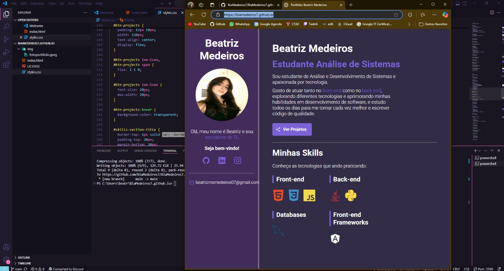

# Meu Primeiro Portfólio

## Sobre o Projeto

Este portfólio , um projeto do curso de Git do Matheus Battisti, coloco em prática minhas habilidades de desenvolvimento front-end. Usei apenas **HTML** e **CSS** para criar uma página simples.

## Tecnologias Utilizadas

- **HTML**: Estrutura básica do site.
- **CSS**: Estilização e design responsivo.

## Visualize o Projeto

Você pode ver o meu portfólio em produção através do link abaixo:

🔗 [Acesse meu portfólio](https://biamedeiros7.github.io/)

## Funcionalidades

- **Design responsivo**: O layout se ajusta a diferentes tamanhos de tela, oferecendo uma boa experiência em dispositivos móveis e desktops.
- **Design minimalista e moderno**: Usei cores suaves e uma estrutura simples para proporcionar uma navegação intuitiva.
- **Informações pessoais**: Apresentação sobre mim, habilidades, e projetos.

## Capturas de Tela

  

## Próximos Passos

Estou trabalhando para adicionar mais funcionalidades ao meu portfólio, como:

- **Página de projetos**: Onde vou compartilhar detalhes sobre meus projetos.
- **Animações CSS**: Para tornar o site mais dinâmico e interativo.

